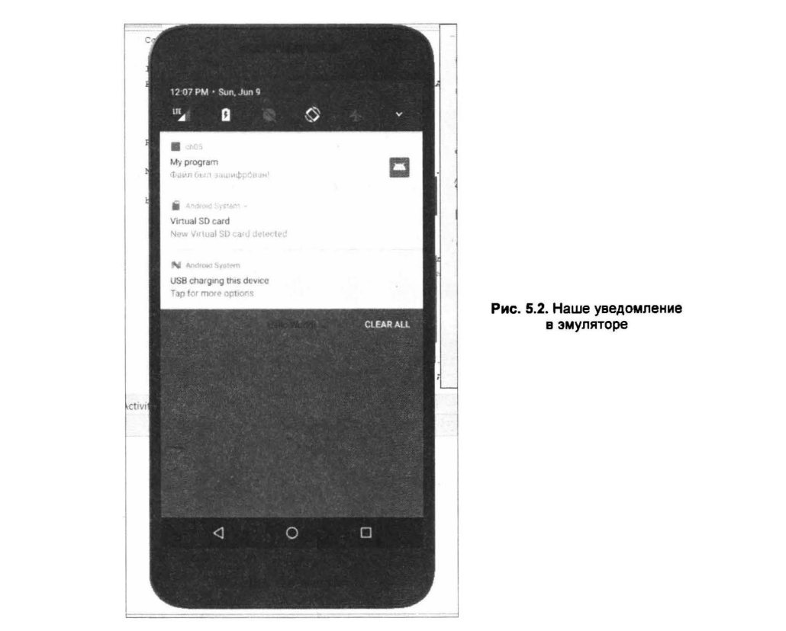

# PMU_Android_labs

## 5.1.2. Уведомление в строке состояния

Создать уведомление в строке состояния немного сложнее. Начиная с API 16, вместо устаревшего
метода *getNotification()* следует использовать метод *build()*. Интересно, что если взглянуть
на исходный код Android, то видно, что старый метод вызывает метод *build()*. Видимо, разработ-
чикам не понравилось имя метода, вот его и объявили устаревшим.

Затем нужно сформировать уведомление с помощью специального менеджера. Ссылку на *NotificationМanager*
можно получить через вьiзов метода *getSysternService()*, передав ему в качестве параметра строковую
константу *NOTIFICATION - SERVICE*, определенную в классе *Context*.

Выводится уведомление с помощью метода *notify()* - это своеобразный аналог
метода *show()* у параметра *тoast* из предыдущего примера (см. листинг 5.1).
Взглянем на код с комментариями:

``` java
Notification.Builder builder = new Notification.Builder(context);
builder.setContentintent(contentintent)
// маленькое изображение
    .setSrnallicon(R.drawaЫe.srnall)
// большое изображение
    .setLargeicon(BitrnapFactory.decodeResource(res, R.drawaЫe.big))
// Только для Android 4.х, в х и 6.х не сработает
    .setTicker("Фaйл был зашифрован!")
    .setWhen(System.currentTimeMillis())
    .setAutoCancel(true)
// Заголовок уведомления
    .setContentTitle("My program")
// Текст уведомления для Android 5.х, 6.х и более новых
    .setContentText("Фaйл был зашифрован!");
Notification notification = builder.build();
NotificationМanager tificationМanager = (NotificationМanager) context
    .getSystemService(Context.NOТIFICATION_SERVICE);
notificationМanager.notify(NOTIFY_ID, notification);
```

Как можно видеть, для Android 4.х надо использовать метод *setTicker()*, который
не сработает в Android 5-7, где вместо него нужно будет задействовать метод
*setContentText()*. На рис. 5.2 приведено уведомление в Android 7.0 (API 24).

Полный код приложения, отображающего уведомление в строке состояния, приведен в листинге 5.2.
Обратите внимание на подключаемые пакеты и переменные, определяемые до основного кода
отображения уведомления. Также заметьте, что в каталог *res\drawable* нужно поместить два
файла: *small.png* и *big.png* - это значки вашего приложения. Впрочем, вы можете просто
скопировать их из папок *res\mipmap-mdpi* (маленькое) и *res\mipmap-xxhdpi* (большое).
При запуске приложения в строке состояния вы увидите значок уведомления и его
текст.

``` java
package corn.example.ch05; 
import android.os.Bundle; 
import  android.support.v7.app.AppCornpatActivity; 
import android.support.v7.widget.Toolbar; 
import android.view.View; 
import android.view.Menu; 
import android.view.Menuitern; 
import android.widget.Toast; 
import android.content.Context; 
import android.app.Notification; 
import android.app.NotificationМanager; 
import android.content.Intent; 
import android.app.Pendingintent; 
import android.graphics.BitmapFactory; 
import android.content.res.Resources; 

puЬlic class MainActivity extends AppCornpatActivity {

// ID уведомпения 
private static final int NarIFY_ID = 101; 

@Override 
protected void onCreate(Bundle savedlnstanceState) 
    super.onCreate(savedinstanceState); 
    setContentView(R.layout.activity_rnain); 
    Context context = getApplicationContext(); 
    Intent notificationintent = new Intent(context, MainActivity.class); 
    Pendingintent contentintent = Pendingintent.getActivity(context, 
    О, notificationintent, 
    Pendingintent.FLAG_CANCEL_CURRENT); 
    Resources res = context.getResources(); 
    Notification.Builder builder = new Notification.Builder(context);
    builder.setContentintent(contentintent) 
    // маленькое изображение 
        .setSmallicon(R.drawaЫe.small) 
    // большое изображение 
        .setLargeicon(BitmapFactory.decodeResource(res, R.drawaЫe.big)) 
    // Только дnя Android 4.х, в 5.х и 6.х не сработает 
        .setTicker("Фaйл был зашифрован!") 
        .setWhen(System.currentTimeMillis()) 
        .setAutoCancel(true) 
    // заголовок уведомления 
        .setContentTitle("My prograrn") 
    // Текст уведомления дnя Android 5.х, 6.х 
        .setContentText("Фaйл был зашифрован!"); 
    Notification notification = builder.build(); 
    NotificationМanager notificationМanager = (NotificationМanager) context 
        .getSystemService(Context.NOГIFICATION_SERVICE); 
    notificationМanager.notify(NOГIFY_ID, notification); 
    // Автоматически сгенерированный средой код удален
    }
}
```

Теперь подробно рассмотрим изменения, которые произошли в новых API. При
подготовке книг я всегда исхожу из того, что приводимый в них код должен работать
на большом количестве устройств самых разных версий. Именно поэтому код
этот не всегда самый современный. Однако, если использовать самый современный
API, код перестанет работать в старых версиях Android, что не всегда хорошо.
Итак, уведомления для относительно новых версий Android (до API 26) лучше
создавать с помощью объекта *Notificationcompat.Builder*:

``` java 
NotificationCompat.Builder rnВuilder = new NotificationCompat.Builder(this) 
    .setSmallicon(R.drawaЫe.notification_icon) 
    .setContentTitle(textTitle) 
    .setContentText(textContent) 
    .setPriority(NotificationCompat.PRIORITY_DEFAULT);
```

Конструктору вы должны передать маленький значок, получить который можно
методом *setSmallicon()*, заголовок, устанавливаемый методом *setContentTitle()*,
текст уведомления, задаваемый методом *setcontentтext()* и приоритет,
устанавливаемый методом *setPriority()*. Приоритет определяет, насколько «навязчивым»
должно быть уведомление в Android 7.1 (API 25) и ниже. В Android 8.0 (начиная с API 26) и выше вы должны использовать
каналы уведомлений, которые будут
рассмотрены далее.

> Наnомню уровни API: 24 - 7.0, 25 - 7.1, 26 - 8.0, 27 - 8.1, 28 - 9.0

## 5.1.3. Каналы уведомлений в Android 9.0

В Android 8.0 (API 26+) вы должны не просто отображать уведомления - вам следует
зарегистрировать канал, уведомлений вашего приложения, передав экземпляр
объекта *NotificationChannel* методу *createNotificationChannel*. Однако этот код
будет работать только на API 26 и выше.

``` java
private void createNotificationChannel(} { 
    // Создаем NotificationChannel, работает на API 26+ 
    if (Build.VERSION.SDK_INT >= Build.VERSION_CODES.O) 
    CharSequence narne = getString(R.string.channel_narne); 
    String description = getString(R.string.channel_description); 
    int importance = NotificationМanager.IMPORTANCE_DEFAULT; 
    NotificationChannel channel = new NotificationChannel(CНANNEL ID, narne, 
    channel.setDescription(description); 
    // Регистрируем канал в системе, после этого нельзя 
    // изменять настройки канала (важность - irnportance, 
    // описание и т. д.} 
    importance} ; 
    NotificationМanager notificationМanager = 
    getSystemService(NotificationМanager.class); 
    notificationМanager.createNotificationChannel(channel); 
    }
}
```

Поскольку канал вы должны зарегистрировать до того, как начнете отправлять
уведомления, вам надо выполнить этот код как можно раньше после запуска вашего
приложения.

## 5.1.4. Определение действия уведомления

Обычно, если пользователь нажимает на уведомление, то запускается ваше приложение.
Это общепринятая практика. Если нужно просто вывести уведомление и не
требуется, чтобы при нажатии на него приложение запускалось, используйте вызов
намерения без параметров:

``` java
Intent intent = new Intent();
```

Рассмотрим другой пример, где при нажатии на уведомлении открывается ваш
сайт:

``` java
Context context = getApplicationContext(); 
Intent notificationintent = new Intent(Intent.ACТION_VIEW, 
Uri.parse("https://dkws.org.ua/"));
Pendingintent pendingintent = Pendingintent.getActivity(context, О, 
notificationintent, Pendingintent.FlAG_CANCEL_CURRENT); 
Notification.Builder builder = new Notification.Builder(context) 
    .setContentTitle("Пoceтитe сайт") 
    .setContentText("https://dkws.org.ua/") 
    .setTicker("Info") .setWhen(Systern.currentTirneMillis()) 
    .setContentintent(pendingintent) 
    .setDefaults(Notification.DEFAULT_SOUND) .setAutoCancel(true) 
    .setSmallicon(R.drawaЫe.ic launcher); 
NotificationМanager notificationМanager = (NotificationМanager) 
getSystemService(Context.NOTIFICATION_SERVICE); 
notificationМanager.notify(NOTIFY_ID, builder.build());
```

Как можно видеть, здесь мы в Intent () задаем адрес сайта, который
нужно посетить. Адрес сайта в уведомлении никак не влияет на действие.
Поэтому в уведомлении можно вывести короткий адрес сайта - например, dkws.org.ua,
а в Intent ()задать полный адрес - https://dkws.org.ua/.

## 5.1.5. Кнопки действия

Иногда простого нажатия на уведомление недостаточно, и нужно добавить
несколько кнопок действия. Для создания кнопки действия передайте в метод
*addAction()* параметр *Pendingintent*. Код выглядит примерно так:

``` java
Intent snoozeintent = new Intent(this, MyBroadcastReceiver.class); 
snoozeintent.setAction(ACTION_SNOOZE); 
snoozeintent.putExtra(EXTRA_NOTIFICATION_ID, О); 
Pendingintent snoozePendingintent = 
Pendingintent.getBroadcast(this, О, snoozeintent, О); 
NotificationCompat.Builder mВuilder = new NotificationCompat.Builder(this, 
CНANNEL_ID) 
    .setSmallicon(R.drawaЫe.notification_icon) 
    .setContentTitle("Moe уведомление") 
    .setContentText("Пpивeт!") 
    .setPriority(NotificationCompat.PRIORITY_DEFAULT) 
    .setContentintent(pendingintent) 
    .addAction(R.drawaЫe.ic_snooze, getString(R.string.snooze), 
snoozePendingintent);
```

В метод *addAction()* вы должны передать также изображение для вашей кнопки
и текст надписи на кнопке.

Дополнительную информацию (в том числе способы организации ввода из области
уведомлений и построения индикатора процесса в области уведомлений) вы можете
найти по адресу:
https://developer.android.com/training/notify-user/buildnotification.

## 5.1.6. Удаление собственных уведомлений

Если вы ошибочно отправили уведомление, тогда удалить его можно так:

``` java
notificationМanager.cancel(NOTIFY_ID);
```

## 5.1.7. Звуковая, световая и вибросигнализация

При выдаче уведомления можно добавить звуковой сигнал, вибросигнал и
мерцание светодиодов телефона:

- Notification.DEFAULT_LIGHTS-мepцaниe светодиодами;
- Notification. DEFAULT - SOUND- звуковой сигнал;
- Notification. DEFAULT - VIBRATE - вибрация.

Тип уведомления задается так:

``` java
notification.defaults = Notification.DEFAULT_SOUND; 
Notification.DEFAULT_VIBRATE; 
```

Как можно видеть, здесь будут использоваться и звук, и вибрация.
Параметры звука и вибрации принимаются по умолчанию.
В большинстве случаев этого достаточно, однако параметры уведомления
допускается «кастомизировать». Задать звук
уведомления можно так:

``` java
notification.sound = Uri.parse("file:///sdcard/warning.mpЗ"); 
```

Но это только в том случае, если вы знаете точный путь к звуковому файлу. Вы
можете также добавить звуковой файл в качестве ресурса и использовать его в
своем проекте.

Для использования в приложении вибрации нужно в файл манифеста добавить
строку:

``` xml
<uses-permission android:na.me="android.permission.VIBRATE"/>
```

В настоящее время эмулятор Android не умеет воспроизводить звуковое и световое
уведомление (про вибрацию, думаю, и так понятно). Поэтому, если приведенный
код не работает в эмуляторе, - не расстраивайтесь, просто запустите созданный
АРК-файл на реальном устройстве.

## 5.1.8. Вывод длинного текста

Если вы попробуете установить длинный текст методом setContentText (), то
заметите, что он отображен не полностью. Для отображения длинного текста нужно
использовать метод *BigTextstyle().bigТext()*. Вот пример вывода длинного текста:

``` java
puЫic void sendВigTextStyleNotification(View view) { 
String ЬigText = "Lorem Ipsum" 
+" is simply dummy text of the printing and typesetting 
industry. Lorem Ipsum has been the industry's standard 
dummy text ever since the 1500s";
Intent intent = new Intent(this, Seconc!Activity.class); 
Pendingintent pintent = Pendingintent.getActivity(this, О, intent, О); 
Notification.Builder builder = new Notification.Builder(this) 
    .setTicker ( "Lorem Ipsum! ") 
    .setContentTitle("Длиннoe уведомление") 
    .setContentText( 
    "is simply dшmny text of the printing and typesetting industry.") 
    .setSmallicon(R.drawaЫe.ic_launcher) 
    .adclAction(R.drawaЫe.ic_launcher, "Run activity", 
    pintent).setAutoCancel(true); 
Notification notification = new Notification.BigTextStyle(builder) 
    .bigТext(bigText).build(); 
NotificationМanager notificationМanager = (NotificationМanager) 
getSystemService(NOTIFICATION_SERVICE); 
notificationМanager.notify(l, notification);
}
```